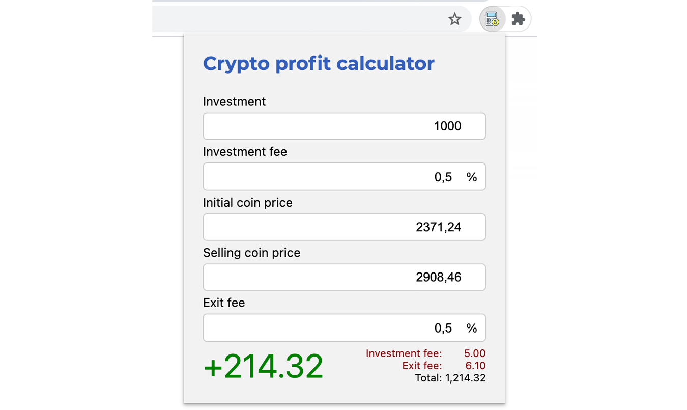

# Crypto profit calculator

Crypto profit calculator is a Chrome Extension that automatically calculates profit on a crypto exchange.

## Installation - Chrome Web Store

Follow the URL: https://chrome.google.com/webstore/detail/crypto-profit-calculator/eeaopjfgmpffmkghfgcemcaainoiapgb

Click on `Add to Chrome`

Click on `Add Extension`

## Usage

### Calculate crypto profit

`Click on the extension` in the navigation bar.
Enter a value in each input field.

The profit after deduction of fees will automatically be calculated.

Additionally, the amount of fees paid will be shown and the amount invested plus the profit.
